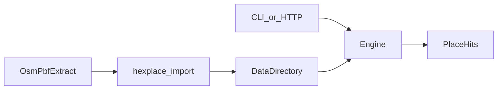
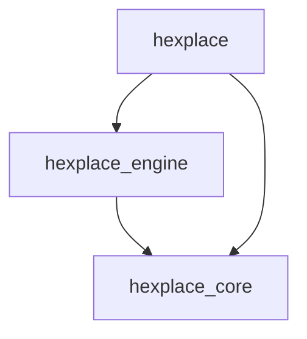
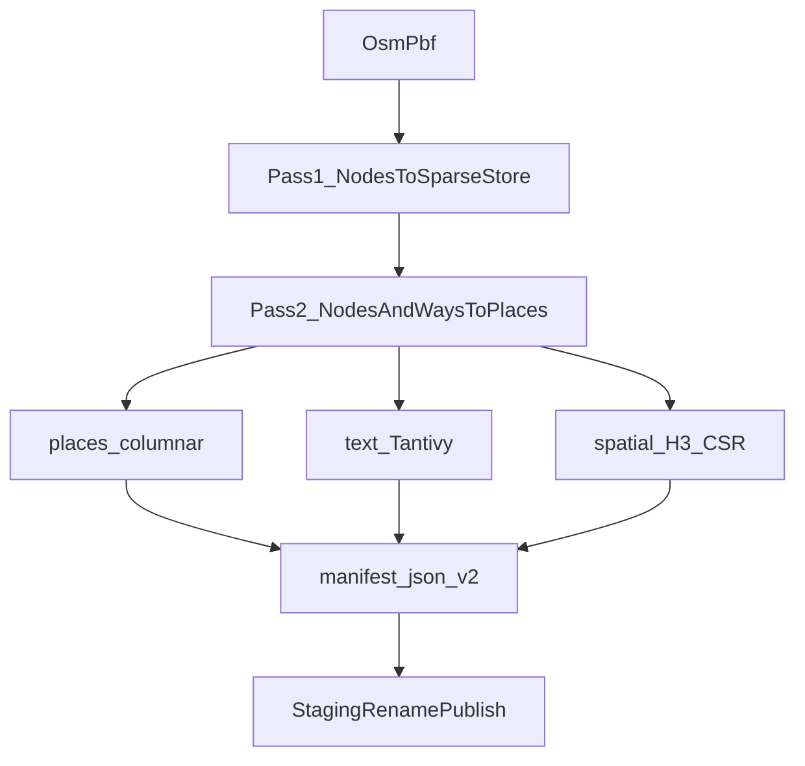
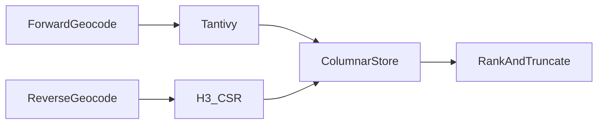

# Hexplace architecture

This document gives the high-level system architecture of the Hexplace
workspace.

## Purpose and scope

Hexplace is an in-process OpenStreetMap geocoder for **regional extracts**.
It imports an `.osm.pbf` into local memory-mapped indexes and serves forward
search, reverse geocoding, mixed batch, and bulk reverse over a CLI and HTTP
API.

This file covers:

- Workspace crate shape and module map
- Import and publish data flow
- On-disk index layout (schema v2)
- Query paths (geocode, reverse, batch, bulk)
- Dependency direction and composition root
- Out-of-scope product boundaries and future planet notes

This file does **not** cover:

- Install, env vars, and ops — see [README.md](../../README.md)
- Agent tooling index — see [AGENTS.md](../../AGENTS.md)
- Import/lock edit rules — see [hexplace-import](../skills/hexplace-import/SKILL.md)
- Condensed agent playbook — see [hexplace-architecture](../skills/hexplace-architecture/SKILL.md)

## System context

Callers use the `hexplace` binary (CLI or `serve` HTTP) against a data
directory of indexes. There is no separate database process. Indexes are
mmap/Tantivy/H3 files opened by `Engine` in
[`crates/hexplace-engine`](../../crates/hexplace-engine).

Workspace MSRV is 1.81 (`rust-version` in the root `Cargo.toml`). Code is MIT;
OSM data remains ODbL.



## Crate map

Dependency direction: `hexplace` → `hexplace-engine` → `hexplace-core`.

| Crate | Role |
| --- | --- |
| [`hexplace-core`](../../crates/hexplace-core) | Domain types and narrow traits (`PlaceStore`, `TextSearcher`, `SpatialSearcher`, `Geocoder`) |
| [`hexplace-engine`](../../crates/hexplace-engine) | Import, columnar store, Tantivy, H3 CSR, ranking, `Engine` |
| [`hexplace`](../../crates/hexplace) | Clap CLI + Axum HTTP; holds `Arc<Engine>` |



Core must not depend on engine. Prefer static dispatch inside the engine.
HTTP depends on the `Geocoder` trait; `Engine` implements it.

### Core modules

| Module | Role |
| --- | --- |
| `place` | `Place`, `PlaceHit`, address fields |
| `query` | `SearchQuery`, `ReverseQuery`, limits |
| `traits` | Store/search/geocode trait surfaces |
| `error` | Shared error types |

### Engine modules

| Module | Role |
| --- | --- |
| `service` | `Engine` composition root and query orchestration |
| `import` | PBF import, node stores, OSM place filter, staging publish |
| `store` | Columnar mmap place files under `places/` |
| `text` | Tantivy index under `text/` |
| `spatial` | CSR H3 fine/coarse under `spatial/` |
| `manifest` | `manifest.json`, schema/format markers |
| `ranking` / `display` | Score blend and display-name parts |
| `binio` | Bulk reverse binary codecs |

### App modules

| Module | Role |
| --- | --- |
| `cli` | Subcommands: import, serve, search, reverse, batch, bench |
| `api` | `/v1/*` HTTP routes |
| `main` | Process entry, logging |

## Import pipeline

Default extract path (see [`crates/hexplace-engine/src/import`](../../crates/hexplace-engine/src/import)):

1. Stream the PBF with `osmpbf`.
2. Collect node coordinates in a `SparseNodeStore` (sorted id array) for way
   centroids. A `FlatNodeStore` exists for planet-capable imports but is not
   used by the default extract path.
3. Keep searchable objects from **nodes and ways only**: named places
   (including named POIs/highways) and address features with
   housenumber+street. **OSM relations are not imported.**
4. Assign dense `place_id` values and write columnar place files under
   `places/` (`coords.bin`, `meta.bin`, `strings.bin`).
5. Build a Tantivy document per place from names and address fields.
6. Index each place into a single fine H3 cell (res 10) and its coarse cell
   (res 6). Ring expansion happens at query time, not index time.
7. Write `manifest.json` (schema v2) with resolutions and format markers.

Import writes a staging tree beside the target, then rename-publishes so a
failed import cannot leave a torn live index. Serve holds a shared flock on
the data directory; publish needs exclusive access — stop serve before
re-import, then restart serve to remmap.



## On-disk indexes (schema v2)

```text
<data-dir>/
  manifest.json
  places/
    coords.bin      # i32 lat/lon e7
    meta.bin
    strings.bin
  text/             # Tantivy
  spatial/
    fine/           # CSR H3 res 10
    coarse/         # CSR H3 res 6
```

The place store is `places/`, not a legacy top-level `places.bin`. Serve
refuses missing or unsupported schema/format markers
(`store_format` / `spatial_format`).

## Query paths

Orchestrated by `Engine` in
[`crates/hexplace-engine/src/service.rs`](../../crates/hexplace-engine/src/service.rs)
and exposed by
[`crates/hexplace/src/api.rs`](../../crates/hexplace/src/api.rs).

### Forward (`/v1/geocode`, CLI `search`)

Normalize tokens → Tantivy query (up to `SearchQuery::MAX_LIMIT` candidates) →
hydrate places from the columnar store → combine text score with importance →
truncate to the request `limit` (max 50).

### Reverse (`/v1/reverse`, CLI `reverse`)

Convert lat/lon to a fine H3 cell → CSR postings slice → ring-expand if
under-populated → coarse fallback if still empty or under the request `limit`
→ rank by distance using `coords.bin` only → hydrate string fields for the
`limit` winners (max 50).

### Batch (`/v1/batch`, CLI `batch`)

Process mixed geocode/reverse items in parallel (`std::thread::scope`) against
warm indexes. Up to 100,000 items per request.

### Bulk reverse (`/v1/reverse/bulk`)

Accept JSON `{"points":[[lat,lon],...]}` or packed `f32` pairs. Return NDJSON
or packed binary `(u8 present, u64 place_id, f32 score)` based on `Accept`
(`present == 0` for miss/error). Parallelized the same way as batch.



## SOLID boundaries

- **SRP:** import, storage, text search, spatial search, and HTTP each live in
  focused modules.
- **DIP / ISP:** `hexplace-core` owns narrow traits. HTTP depends on
  `Geocoder`; `Engine` implements it and opens concrete mmap / Tantivy / H3
  indexes.
- **OCP:** new index backends can implement the same traits without rewriting
  HTTP handlers once wired at the composition root.

## Future planet scale-up

Extracts use the sparse node store. For planet scale (not implemented):

- Switch import to `FlatNodeStore` (`8 bytes × max_node_id`, ~100 GB).
- Partition place / Tantivy / CSR files by coarse H3 cell or country.
- Introduce multi-shard query routing only after partitioned indexes exist;
  nothing in this release scaffolds that path.

Those changes should not require redesigning the HTTP API.

## Out of scope for this release

- Actually importing a planet file
- Live minutely / diff replication
- OSM relation import (admin boundaries, multipolygon POIs) and full
  administrative polygon point-in-polygon hierarchy
- House-number interpolation along ways
- Nominatim-style or locale-aware display names (labels use a fixed order:
  name, house number, road, city, postcode, country as separate comma parts)
- Learned, population-based, or multilingual importance models (import uses a
  coarse OSM tag heuristic only)

User-facing summary: [README Known limitations](../../README.md#known-limitations).
